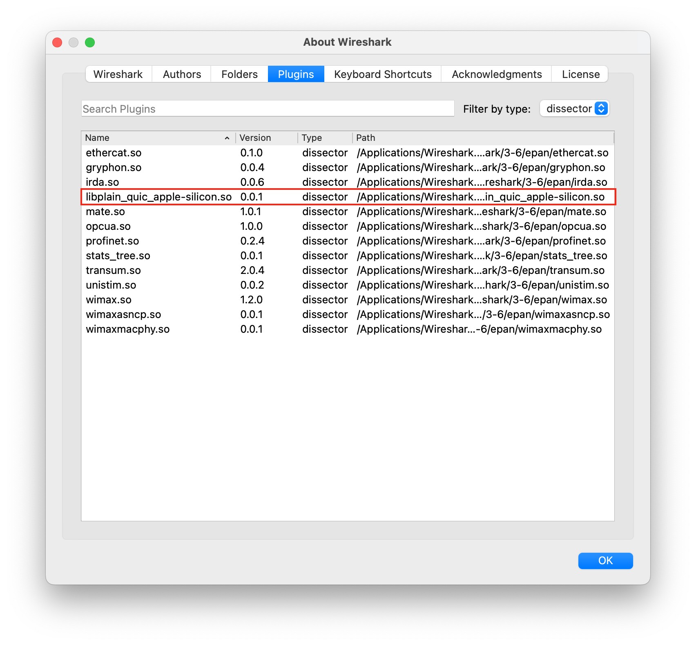
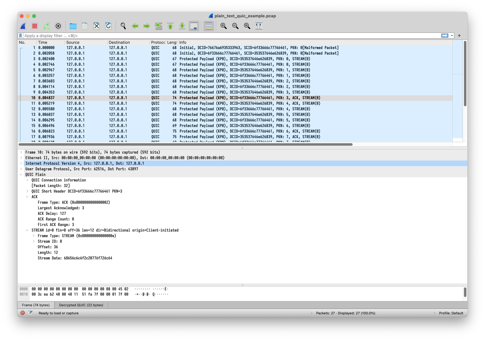
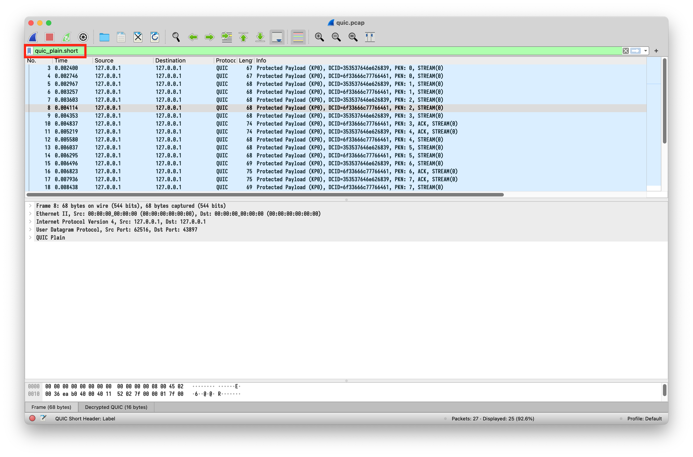

# How to use the plain text plugin.

* Download the dynamic library according to your Operating System. And put it to the OS-specific directory as described in the [Wireshark Document](https://www.wireshark.org/docs/wsug_html_chunked/ChPluginFolders.html).

    * Install `glib` using `brew install glib` in macOS.

* Check that plugin is displayed on "About Wireshark" -> "Plugins" -> Filter by type "dissector".

* Open the example pcap (`quic.pcap` in this directory) using Wireshark. It should decode plain text QUIC packet successfully as shown below:

Note that QUIC packets are displayed as "QUIC Plain" instead of "QUIC IETF". Ethernet packets should be at least 64 bytes long to be decoded correctly.

* User `quic_plain` instead of `quic` to filter packets in the Wireshark query window.

Please submit issues on https://github.com/THU-QUIC-Project/THU-QUIC-Project-2022 for any problems.
